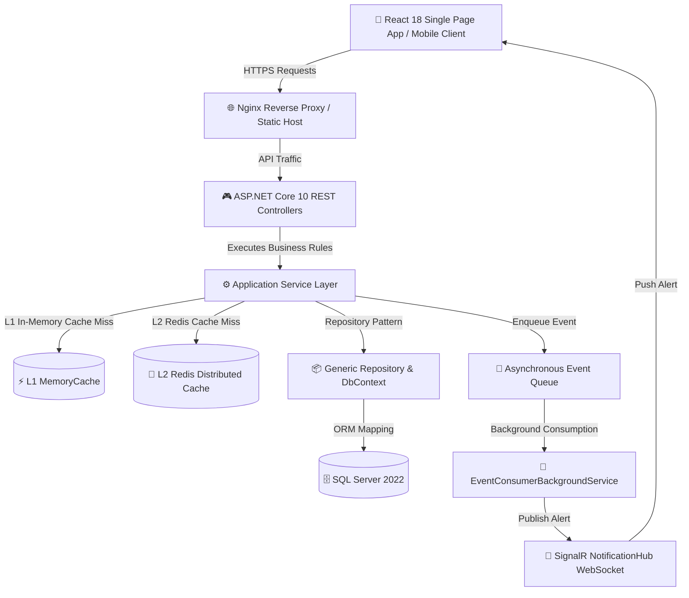
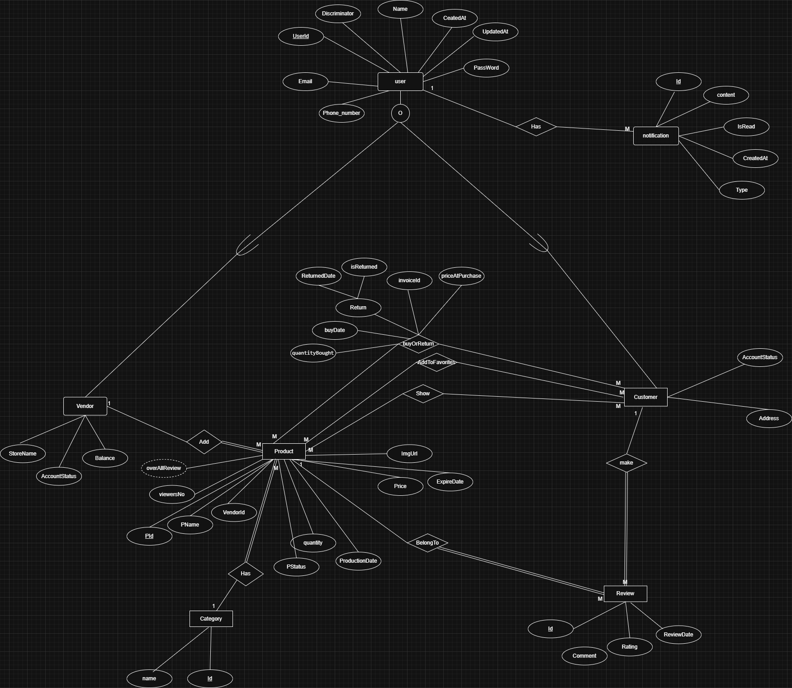

# 🛒 VendorHub - Production-Ready Multi-Vendor E-Commerce Platform

[](https://dotnet.microsoft.com/)
[](https://reactjs.org/)
[](VendorHub.UnitTests)
[](https://www.microsoft.com/sql-server/)
[](https://redis.io/)
[](https://datalust.co/seq)
[](https://www.docker.com/)
[](LICENSE)

---

## 🎯 Executive Overview & Engineering Highlights

**VendorHub** is a high-performance, enterprise-grade multi-vendor e-commerce platform built with **Clean Architecture**, **ASP.NET Core 10 Web API**, and a modern **React 18 Storefront**. 

Designed with production scalability and security at its core, VendorHub incorporates **two-level distributed caching (L1 + L2)**, **SkiaSharp WebP image compression & optimization**, **asynchronous event-driven background queues**, **claims-based dynamic permissions**, **magic-byte image security validation**, **Serilog + Seq centralized log aggregation**, and **real-time SignalR WebSocket notifications**.

This project incorporates decoupled domain layer design, generic repository/unit-of-work patterns, optimistic concurrency control, RFC 7807 problem details, and multi-container Docker orchestration.

#### 💡 Engineering Methodology & Trade-Off Analysis
Every architectural challenge in VendorHub was tackled through a systematic evaluation process: analyzing root cause bottlenecks, benchmarking alternative design patterns (e.g., MediatR vs. lightweight event queues, TPH vs. TPT inheritance), evaluating complexity vs. performance trade-offs, and implementing a lean, high-throughput solution.

---

## 🏗️ System Architecture & Data Flow



---

## 🗄️ Database Architecture & Evolution

### Initial Database Design (EERD)

During initial project inception, the database model was drafted as shown below:



#### 🔍 Key Architectural & Engineering Challenges Solved:

1. **Repetitive Controller `if (Success) ... else` Response Boilerplate**:
   - *Problem*: Controllers previously suffered from verbose, repetitive `if (result.Success) return Ok(...); else if (result.Status == ...) return BadRequest(...)` checks across all 12 controllers, causing code duplication and inconsistent HTTP status returns.
   - *Solution*: Designed a unified `GeneralResponse<T>` factory wrapper paired with `ControllerExtensions.cs` (`this.HandleResult(result)`). All controller actions now delegate status code mapping cleanly in a single line:
     ```csharp
     [HttpGet("{id}")]
     public async Task<IActionResult> GetById(int id)
     {
         var result = await _productService.GetByIdAsync(id);
         return this.HandleResult(result); // Automatically maps ResultStatus to 200, 400, 401, 403, 404, 500
     }
     ```

2. **Database Bottlenecks & Stale Data Anomalies on Read-Heavy Entities (Categories)**:
   - *Problem*: Entities like `Category` are read continuously by millions of customers but written rarely (only by Admins). Querying SQL Server on every request created database bottlenecks, while naive caching caused stale data when admins updated category names.
   - *Solution*: Implemented an **Entity Access-Pattern Caching Strategy**. Categories are aggressively cached with long-lived TTLs to serve 99.9% of reads from L1 In-Memory / L2 Redis caches. On admin mutations (Add/Update/Delete), an event immediately triggers `ICacheService.RemoveAsync(key)`, purging L1 and L2 simultaneously to guarantee instant consistency.

3. **Image Upload Header Security Bypass Vulnerability**:
   - *Problem*: Standard `stream.Read(...)` could return incomplete header bytes on slow streams, bypassing image signature verification.
   - *Solution*: Implemented strict `stream.ReadExactly(...)` in `IImageValidator` to inspect exact magic header bytes (PNG, JPEG, WebP) with zero security bypass.

4. **Pragmatic Architecture (Avoiding MediatR Over-Engineering) & Contextual Logging**:
   - *Problem*: Introducing heavy frameworks like MediatR adds unnecessary abstraction layers, indirection overhead, and complex handler pipelines for standard service calls. At the same time, standard `ILogger.LogError` methods lack structured object destructuring when logging complex exception payloads or transaction rollbacks.
   - *Solution*: Adopted a **lean, pragmatic Clean Architecture** utilizing lightweight `IEventQueue` and custom extension methods. Built `LoggerExtensions.cs` (`LogErrorWithContext`, `LogInfoWithContext`, `LogWarningWithContext`), leveraging Serilog's `LogContext.PushProperty(name, payload, destructureObjects: true)` to inject structured JSON metadata into logs cleanly without MediatR bloat:
     ```csharp
     // Automatically pushes destructured error object into Serilog context
     _logger.LogErrorWithContext("Concurrency conflict updating status for OrderId: {OrderId}", ex, new { OrderId = orderId });
     ```

5. **EF Core Migration Failure on Notification Metadata Dictionary**:
   - *Problem*: EF Core attempted to map `Dictionary<string, object> Data` on `Notification` as a database entity, throwing migration mapping errors.
   - *Solution*: Added `[NotMapped]` attribute to `Notification.Data` to store runtime JSON metadata safely out-of-db.

---

## ⚡ Core Technical Engineering Pillars

### 🚀 1. High-Performance Two-Level Caching (L1 + L2) & Use-Case Driven Strategy

To maximize throughput and eliminate database bottlenecks, VendorHub implements a two-tiered caching pipeline (`ICacheService`) tailored specifically to entity access patterns:

- **⚡ L1 (In-Memory Cache)**: Built-in `IMemoryCache` providing zero-latency (<1ms) responses for local node lookups.
- **🔴 L2 (Distributed Cache)**: `IDistributedCache` backed by **Redis** for distributed cache sharing across load-balanced application servers.

#### 💡 Use-Case Driven Strategy (Read-Heavy vs. Write-Heavy Entities):
- **Category & Catalog Caching**: Product categories and featured items are queried continuously by every customer browsing the marketplace (extremely high read frequency), but are updated very infrequently (only when an Admin creates or toggles a category). 
- **Aggressive TTL & Instant Event Invalidation**: Categories are cached aggressively with long-lived TTLs to serve 99.9% of catalog traffic directly from cache without hitting SQL Server.
- **Event-Driven Cache Purging**: The moment an Admin mutates a category or product (Add/Update/Delete), an event triggers `_cacheService.RemoveAsync(key)`, purging both L1 Memory Cache and L2 Redis Distributed Cache simultaneously. This ensures instant data consistency across all cluster nodes with zero stale reads.

#### 🔗 Fluent LINQ Cache Extensions (`CacheExtensions.cs`):
Query caching is seamlessly integrated into LINQ via `IQueryable<T>` extension methods (`ToCachedListAsync`, `ToCachedFirstOrDefaultAsync`). Developers can write fluent database queries that automatically check L1/L2 cache before falling back to SQL Server:
```csharp
// Transparently retrieves from L1/L2 cache or queries SQL Server & populates cache
var activeCategories = await _dbContext.Categories
    .Where(c => c.IsActive)
    .ToCachedListAsync(_cacheService, "active_categories", TimeSpan.FromHours(24));
```

---

### 🔄 2. Asynchronous Event-Driven Queue & Background Processing
Operations such as order creation and status changes emit domain events (`OrderStatusChangedEvent`) into an in-memory queue (`IEventQueue`).
- **Out-of-Band Execution**: `EventConsumerBackgroundService` processes queued events asynchronously in the background.
- **Non-Blocking User Requests**: HTTP request threads complete instantly (200 OK / 201 Created) while notification persistence and SignalR websocket broadcasts execute in background worker tasks.

---

### 🚨 3. Global Exception Handling & RFC 7807 ProblemDetails
VendorHub implements `IExceptionHandler` (`GlobalExceptionHandler.cs`) to catch unhandled application exceptions globally:
- **Zero Information Leakage**: Stack traces and internal exception details are suppressed in production.
- **Standardized Response**: Formats errors using **RFC 7807 ProblemDetails** standards, attaching a unique HTTP `requestId` trace identifier for end-to-end telemetry debugging.

---

### 📝 4. Enterprise Serilog Logging & Context Enrichment (`LoggerExtensions.cs`)
Structured logging is powered by **Serilog** and enhanced with custom context-enrichment extensions:
- **`LoggerExtensions.cs`**: Implements `LogErrorWithContext`, `LogInfoWithContext`, and `LogWarningWithContext`. Uses `Serilog.Context.LogContext.PushProperty(name, payload, destructureObjects: true)` to push complex error objects, exception parameters, and payload data directly into Serilog context without cluttering log messages.
- **Multi-Sink Logging**: Formatted output to Console and daily rolling compact JSON log files (`logs/prod-log-.json`).
- **Context Enrichment**: Log entries automatically capture `MachineName`, `ThreadId`, `RequestId`, and authenticated user claims.

---

### 🛠️ 5. Custom Clean Extensions Architecture
- **`ControllerExtensions.cs`**: Provides `this.HandleResult(result)`, mapping `ResultStatus` factory enum codes directly to standard HTTP status codes across all 12 controllers.
- **`CacheExtensions.cs`**: Fluent LINQ extensions (`ToCachedListAsync`, `ToCachedFirstOrDefaultAsync`) extending `IQueryable<T>` to execute two-tier L1/L2 cache checks before DB evaluation.
- **`LoggerExtensions.cs`**: Enables structured contextual logging via Serilog `LogContext` destructuring (`LogErrorWithContext`, `LogInfoWithContext`, `LogWarningWithContext`).
- **`QueryableExtensions.cs`**: Reusable LINQ extensions for dynamic pagination (`ToPagedListAsync`) and dynamic column sorting.
- **`HubExtensions.cs`**: SignalR helper methods for extracting authenticated user claims from websocket contexts.

---

### 🔐 6. Claims-Based Dynamic Permission Engine
In addition to standard role authorization (`Admin`, `Vendor`, `Customer`), VendorHub features a fine-grained per-vendor permission system:
- **`[RequirePermission(PermissionType)]`**: Custom action filter verifying specific claims (e.g., `CanUploadProducts`, `CanEditProducts`, `CanDeleteProducts`).
- **Admin Moderation**: Super admins can grant/revoke specific permissions for individual vendors dynamically without redeploying code.

---

### 🛡️ 7. Automated Magic-Byte File Upload Security Validation
To prevent file upload vulnerabilities and execution attacks:
- **`IImageValidator`**: Validates uploaded product/category images by reading magic header bytes (PNG `89 50 4E 47`, JPEG `FF D8 FF`, WebP `52 49 46 46`).
- **Stream Integrity**: Uses strict `stream.ReadExactly(...)` to prevent corrupted header bypasses.

---

### 💬 8. Real-Time SignalR Websocket Notifications
Connected clients receive instant, real-time alerts via `NotificationHub`:
- Push updates when an order status changes (`Pending` ➔ `Processing` ➔ `Shipped` ➔ `Delivered`).
- Push administrative approvals for new vendor accounts and product submissions.

---

## 🎯 Unified API Response & Status Code Mapping

ALL API responses from VendorHub follow a unified, predictable JSON contract (`GeneralResponse<T>`):

```json
{
  "success": true,
  "message": "Operation completed successfully.",
  "data": {
    "id": 42,
    "name": "Wireless Noise-Canceling Headphones",
    "price": 199.99,
    "stock": 50
  }
}
```

### HTTP Status Code Mapping Reference

| ResultStatus | HTTP Code | Description |
| :--- | :--- | :--- |
| **`Success`** | `200 OK` | Read/update operation succeeded |
| **`Created`** | `201 Created` | New resource created (Order, Product, User, Review) |
| **`InvalidInput`** | `400 Bad Request` | Input validation or business rule failed |
| **`Unauthenticated`** | `401 Unauthorized` | Missing, invalid, or expired JWT bearer token |
| **`Forbidden`** | `403 Forbidden` | Insufficient role or permission claim |
| **`NotFound`** | `404 Not Found` | Requested entity record does not exist |
| **`Error`** | `500 Internal Error` | Global exception caught cleanly |

---

## 🧪 Comprehensive Unit Testing Suite (`VendorHub.UnitTests`)

VendorHub features an extensive, production-grade test suite built with **xUnit**, **Moq**, **FluentAssertions**, and **MockQueryable.Moq**. Every test is strictly structured according to the **AAA (Arrange-Act-Assert)** pattern and covers positive paths, validation errors, authorization gates, EF Core async queries, optimistic concurrency conflicts, and two-level cache eviction.

```bash
# Run all unit tests from the solution root
dotnet test
```

### 📊 Unit Test Coverage Summary (**121 / 121 Tests Passing**):

| Test Suite | Tests | Domain Scenarios Covered |
| :--- | :---: | :--- |
| **`AccountServiceTests.cs`** | `18/18` | JWT generation, lockout policies, user roles, pending vendor states, registration rollbacks |
| **`CategoryServiceTests.cs`** | `15/15` | Catalog queries, image updates, soft/hard deletion, L1/L2 cache invalidation |
| **`ProductServiceTests.cs`** | `11/11` | Status workflows (Pending, Reviewed, Rejected, Archived), image swap, cache eviction |
| **`OrderServiceTests.cs`** | `9/9` | Atomic checkout, inventory deduction, stock validations, multi-vendor status transitions |
| **`PermissionServiceTests.cs`** | `12/12` | Bitmask flag operations, vendor staff permissions, authorization checks, cache purging |
| **`ImageValidatorTests.cs`** | `17/17` | Binary magic bytes (PNG/JPEG/WebP), size boundaries, extension spoofing, corrupted streams |
| **`NotificationServiceTests.cs`** | `11/11` | Real-time streams, pagination, unread queries, idempotent read toggles, user isolation |
| **`ReviewServiceTests.cs`** | `6/6` | Verified purchaser checks, rating aggregation, duplicate prevention, review pagination |
| **`VendorServiceTests.cs`** | `6/6` | Profile lookups, store details, concurrency fallbacks, paged vendor listings |
| **`CustomerServiceTests.cs`** | `4/4` | Profile retrieval, customer address updates, user boundary checks |
| **`FavoriteServiceTests.cs`** | `5/5` | Wishlist additions, unique constraint handling, removal, average star calculation |
| **`StatisticsServiceTests.cs`** | `2/2` | Analytics caching, dynamic KPI compilation, vendor revenue & monthly sales stats |
| **`DateGreaterThanAttributeTests.cs`** | `5/5` | Expiration vs. production date reflection validation, nullability, equal date guards |

```text
Passed!  - Failed: 0, Passed: 121, Skipped: 0, Total: 121, Duration: ~345 ms
```

---

## 🔬 End-to-End API Integration Suite (`api-tests/`)

VendorHub includes an automated Node.js integration runner covering **100% of all 12 controllers**:

```bash
cd api-tests
node run-all-tests.js
```

### Test Execution Output:

```text
📌 ACCOUNT CONTROLLER     --> ✅ PASS [201]
📌 CATEGORY CONTROLLER    --> ✅ PASS [201]
📌 PRODUCT CONTROLLER     --> ✅ PASS [201]
📌 ADMIN CONTROLLER       --> ✅ PASS [200]
📌 PERMISSION CONTROLLER  --> ✅ PASS [200]
📌 ORDER CONTROLLER       --> ✅ PASS [201]
📌 CUSTOMER CONTROLLER    --> ✅ PASS [200]
📌 VENDOR CONTROLLER      --> ✅ PASS [200]
📌 FAVORITE CONTROLLER    --> ✅ PASS [201]
📌 REVIEW CONTROLLER      --> ✅ PASS [201]
📌 NOTIFICATIONS STREAM   --> ✅ PASS [200]
📌 STATISTICS CONTROLLER  --> ✅ PASS [200]
```

---

## 📦 One-Command Docker Deployment

Deploy the entire production stack (SQL Server, Redis, Backend API, and React Frontend) using Docker Compose:

```bash
docker-compose up --build
```

### Exposed Services:
- **Frontend Storefront**: `http://localhost:3000`
- **Backend Web API (Swagger)**: `http://localhost:7081/swagger`
- **Health Check Endpoint**: `http://localhost:7081/health`
- **SQL Server 2022**: `localhost:1433`
- **Redis Cache**: `localhost:6379`

---

## 💻 Local CLI Development Setup

### 1. Prerequisites
- **.NET 10.0 SDK**
- **Node.js v18+** & **npm**
- **SQL Server 2022** or LocalDB
- **Redis** (Optional)

### 2. Run Backend
```bash
cd backend
dotnet run
```

### 3. Run Frontend
```bash
cd Frontend
npm install
npm run dev
```

---

## 📄 Documentation Index
- [📘 Frontend API Integration & Complete Endpoints Reference Guide](docs/FRONTEND_API_INTEGRATION_GUIDE.md)

---

## 📄 License
Distributed under the **MIT License**. See `LICENSE` for details.
